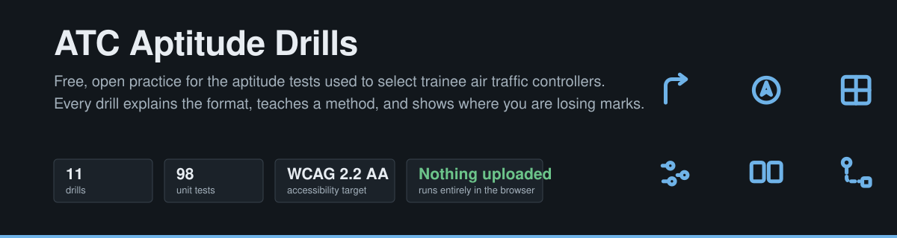

<p align="center">
  <a href="https://github.com/SayamDev/atc-aptitude-drills/actions/workflows/deploy.yml"></a>
  
  
  
</p>

<p align="center"><b><a href="https://sayamdev.github.io/atc-aptitude-drills/">▶︎ Try it in your browser</a></b> — no sign-up, no install, nothing to download.</p>

---

## The problem

Becoming an air traffic controller starts with a day of aptitude tests. They decide who gets
through, and most people meet the format for the first time on the day itself.

Practice material for those tests is almost all behind a paywall, and a lot of it is sold on a
false promise — that it contains "the real questions". It does not. The real items are generated
fresh for every candidate, and no one publishes them.

What *can* legitimately be practised is the **format**, the **method**, and the **pacing**. That
is what this is.

## What it does

Eleven drills, each rebuilt from the publicly documented format of a real selection module.

Every one of them does three things:

| | |
|---|---|
| **Explains the format first** | A short briefing before the clock starts — what is about to happen, and the technique that works. Nobody meets a format cold. |
| **Teaches a method** | Each drill has one insight that makes it tractable. *Watch the swing, not where the arrow ends up.* *Read row runs, not coordinates.* Written by working through the task, not scraped. |
| **Says where you are losing marks** | Not just a score. "You are much weaker when the car heads down the screen" is useful; "68%" is not. |

## What's inside

**The classic modules** — short, strictly timed, marked on accuracy under pressure.

| Drill | What it measures | Time |
|---|---|---|
| Sense of direction | Orientation after changes of direction | 1 min |
| Spatial orientation | Position and course from two cockpit instruments | 3 min |
| Gap challenge | Applying rules in logical steps | 5 min |
| Rule finding | Spotting the rule a set of shapes obeys | 6 min |
| Monitoring ability | Counting moving objects | 2 min |
| Reaction speed | Same-or-different judgements at speed | 3 min |
| Concentration | Staying accurate when nothing is happening | 2 min |
| English language | Fluency, vocabulary and spelling | 10 min |

**The gamified series** — these adapt to you, so the score is the level you reach.

| Drill | What it measures | Time |
|---|---|---|
| Complex planning | Planning a route in the fewest moves | 6 min |
| Visual memory | Reproducing a pattern from short-term memory | 5 min |
| Numeracy | Mental arithmetic against the clock | 6 min |

**One underlying skill** — not a module any employer sets, but the capacity several of them lean on.

| Drill | What it measures | Time |
|---|---|---|
| Circle recall | Visuo-spatial working memory, built to the standard laboratory design | 8 min |

## Why it is different

**It keeps a logbook.** Every finished run is saved, so the front page answers the question
practice is actually for: *am I getting better?* You see your trend per drill, your best, and how
far you have moved since your first attempt.

**It refuses to flatter you.** Where guessing would inflate a score, the scoring catches it —
select every option in the memory drill and you get 100% "accuracy" and a failed level, because
precision is scored too.

**It is honest about what it is.** No claim to have the real questions. Where a drill is a
re-implementation, it says so. Where something is a research task rather than an employer's
module, it says that too.

## Privacy

Nothing is uploaded. There is no account, no analytics, no tracking and no server — the drills and
your logbook run entirely inside your browser, and the logbook never leaves it. You can export it
as a spreadsheet or erase it, both from the page itself.

## Built to be usable by everyone

The project targets **WCAG 2.2 AA**, the international accessibility standard. In practice that
means every drill is fully operable from the keyboard, results are announced to screen readers,
correct and incorrect are never signalled by colour alone, touch targets meet the minimum size,
and the whole thing works at 320px wide and at 200% zoom. Light and dark themes are both
supported and both meet the contrast requirements.

This is checked, not assumed: the interface is audited with **axe-core** across every screen, in
both themes, and the current sweep is clean. The detail, including what is still outstanding, is
in [docs/accessibility.md](docs/accessibility.md).

## What this is not

These are re-implementations built from publicly documented formats. They are **not** the real
test items, which are generated at run time and are not published by anyone. Practise the method
and the pacing — and treat any site selling "real questions" with suspicion.

Test times are the published figures for each module and vary by employer. Check your own
invitation email.

## Running it locally

```bash
npm install
npm run dev
```

Then open the address it prints. Node 20 or newer. `npm test` runs the test suite,
`npm run build` produces the static site.

## For developers

- [How the code is laid out](docs/architecture.md)
- [Adding a drill](docs/adding-a-drill.md)
- [Accessibility notes and known gaps](docs/accessibility.md)
- [Contributing](CONTRIBUTING.md)

## Licence

MIT. Not affiliated with any test publisher, air navigation service provider or employer.
